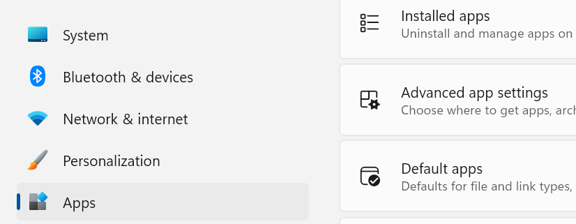
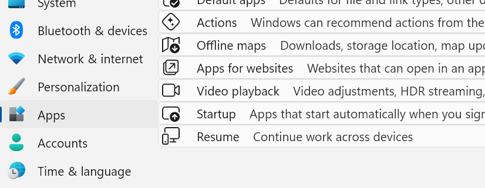
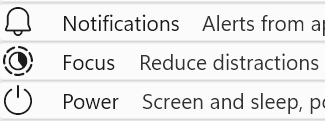
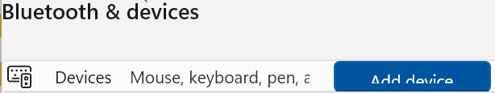

Windows 11 Settings App visual style customizations
 
(via Windhawk customization engine)

#### Densy

A condensed style:
  - Removed a lot of extra whitespace
    - Before: 
    - After: 
  - …and a few helpful ads
    - 

## Known issues
  - Settings App
    - descriptions in 1-line items are not vertically aligned , not sure whether it's possible to fix using XAML styling alone and these 2 grid child lines (name/description) have to be aware of the size of it's cousins, so would likely need a change in the whole grandparent structure (a table)
    - not all elements have their sizes adjusted to fit, e.g., some buttons might be too big 

## Credits
  - [Windhawk](https://windhawk.net) mod engine
  - [Windows 11 Start Menu Styler](https://windhawk.net/mods/windows-11-start-menu-styler), which this one is based upon
